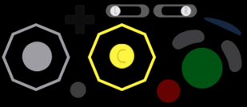

# Mayflash GameCube WiiU Adapter Display

Html/JS GameCube controller display for OBS browser source using the [gamepad API](https://developer.mozilla.org/en-US/docs/Web/API/Gamepad_API/Using_the_Gamepad_API#Complete_example_Displaying_gamepad_state).

## Directories
- mayflash, html/js/images for displaying GameCube controller input.
- media, images/photoshop files for editing.

## Known Issues:
- Having another gamepad connected (e.g. an Xbox controller) plus a Mayflash WiiU Adapter in PC mode means that there are more then 4 gampads connected to the PC. Chromium/Google Chrome only ever gets (the first?) 4. So [Navigator.getGamepads()](https://developer.mozilla.org/en-US/docs/Web/API/Navigator/getGamepads) will only list 4 gamepads, (this includes OBS), where FireFox would have more. If your Gamecube controller doesn't work with this either unplug all other gamepads or change what port you plug the GCC into.
